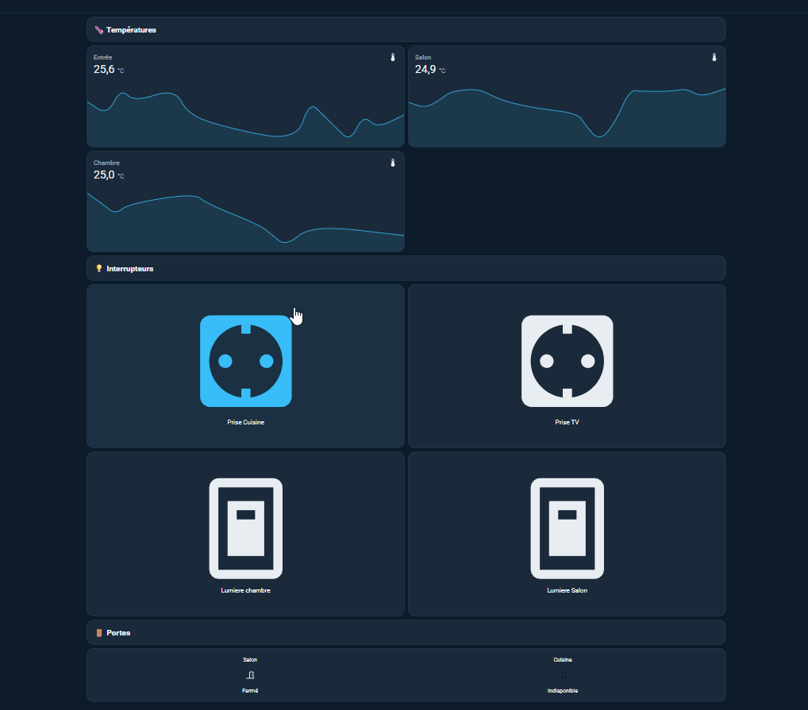
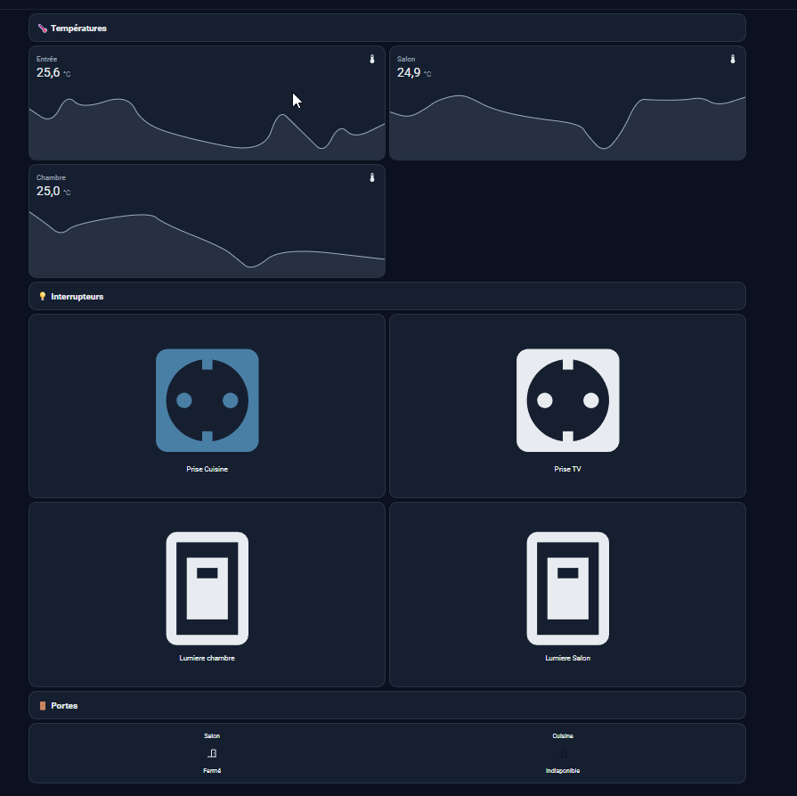
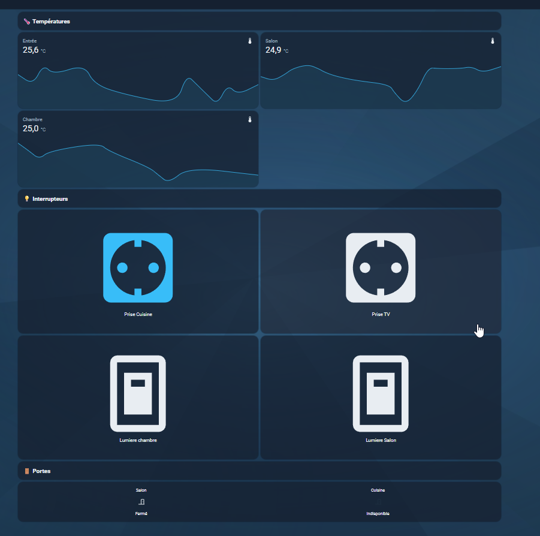
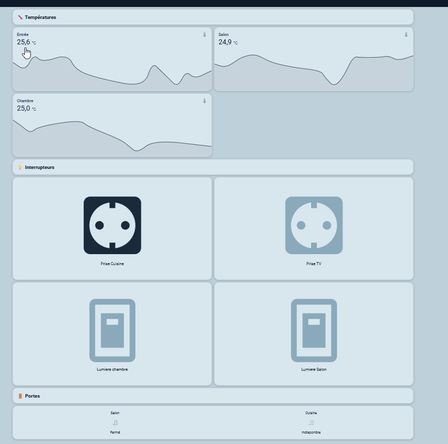

# 🌊 Nuit Méditerranéenne

> Thème bleu sombre pour [Home Assistant](https://www.home-assistant.io/)

[](https://github.com/florent6901/home-assistant-nuit_mediterraneenne)
[](https://github.com/hacs/integration)


---
## 🎨 Aperçu du thème

- **Nuit Méditerranéenne**



- **Nuit Méditerranéenne Dark**



- **Nuit Méditerranéenne Halo**



- **Nuit Méditerranéenne Sylver**



---
## 📦 Installation via HACS

> 💡 Actuellement disponible en **dépôt personnalisé**. > Soumission au store officiel HACS en cours.

1. Ouvrir **HACS** dans Home Assistant
2. Aller dans **Thèmes** → menu ⋮ → **Dépôts personnalisés**
3. Coller l'URL de ce dépôt et sélectionner la catégorie **Thème**
4. Cliquer sur **Ajouter**, puis installer **Nuit Méditerranéenne**
5. Les **4 variantes** sont disponibles dans **Profil → Thème**

---
## 🔧 Installation manuelle

1. Copier le dossier `themes/` dans le dossier `config/themes/`
2. Copier le dossier `www/` dans le dossier `config/www/`
3. Ajouter la ligne dans le fichier `configuration.yaml` :

```yaml
frontend:
  themes: !include_dir_merge_named themes
```

3. Recharger la configuration YAML de Home Assistant
4. Aller dans **Profil** → **Thème** → **Les 4 variantes seront présentes**

---

## 🗂️ Structure du dépôt

```
nuit-mediterraneenne/
├── themes/
│   └── nuit_mediterraneenne.yaml
│   └── nuit_mediterraneenne_silver.yaml
│   └── nuit_mediterraneenne_halo.yaml
│   └── background.png
│   └── nuit_mediterraneenne_dark.yaml
├── www/
│   └── nuit_mediterraneenne_halo/
│       └── background.png
├── hacs.json
├── README.md
└── preview.png
└── preview_dark.png
└── preview_halo.png
└── preview_sylver.png
```

---
## 📋 Changelog

### v1.0.0

- Version initiale — 4 variantes incluses
- Compatibilité Home Assistant 2026.02+

---
## 🤝 Contribution

Si vous avez des suggestions d'amélioration ou des bugs à signaler, n'hésitez pas.